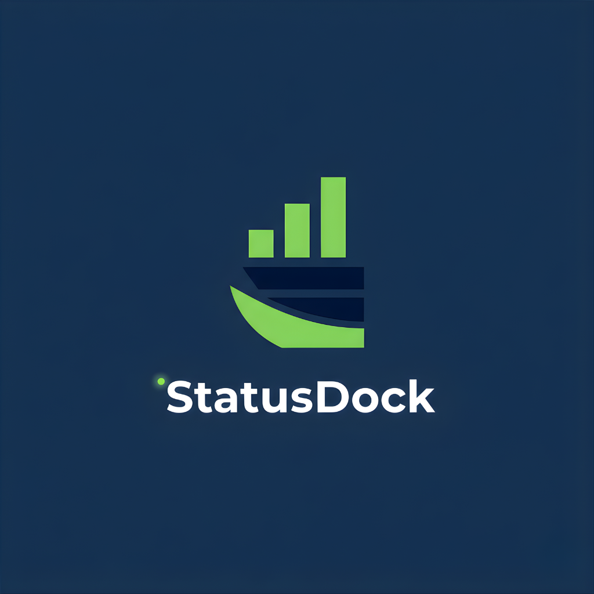

<div align="center">



# 🚢 StatusDock

**A Modern, Self-Hosted Status Page Solution**

Keep your users informed with real-time service status updates, incident tracking, and automated notifications.

[](https://github.com/Docker-Hunterpedia/StatusDock/actions/workflows/deploy-docs.yml)
[](LICENSE)
[](https://docker-hunterpedia.github.io/StatusDock)

[](https://vercel.com/new/clone?repository-url=https%3A%2F%2Fgithub.com%2FDocker-Hunterpedia%2FStatusDock&env=PAYLOAD_SECRET&envDescription=Required%20environment%20variables%20for%20StatusDock&project-name=statusdock&repository-name=statusdock&stores=%5B%7B%22type%22%3A%22postgres%22%7D%2C%7B%22type%22%3A%22blob%22%7D%5D)

[Features](#-features) • [Quick Start](#-quick-start) • [Documentation](https://docker-hunterpedia.github.io/StatusDock/) • [Contributing](#-contributing)

</div>

---

## 📖 About

StatusDock is a powerful, modern status page platform built with [Next.js 15](https://nextjs.org/) and your choice of [Payload CMS 3.x](https://payloadcms.com/) or [Strapi v5](https://strapi.io/). It provides a beautiful, responsive interface for communicating service status, incidents, and maintenance windows to your users.

Unlike SaaS solutions, StatusDock is **completely self-hosted**, giving you full control over your data, infrastructure, and customization. Whether you're running a small startup or a large enterprise, StatusDock scales with your needs.

### Why StatusDock?

- 🎯 **Purpose-Built** — Designed specifically for status page management with incident tracking and notifications
- 🔒 **Privacy-First** — Self-hosted solution means your data stays on your infrastructure
- 💰 **Cost-Effective** — No monthly subscriptions or per-subscriber fees
- 🎨 **Beautiful UI** — Modern, responsive design with dark mode support out of the box
- 🚀 **Production-Ready** — Built with enterprise-grade technologies and best practices
- 🔧 **Highly Customizable** — Full access to source code for unlimited customization
- 🔄 **CMS Flexibility** — Choose between PayloadCMS or Strapi v5 as your headless CMS backend

## ✨ Features

### 🚨 Incident Management
- Create and update incidents in real-time
- Timeline-based incident updates with rich text support
- Categorize incidents by severity (investigating, identified, monitoring, resolved)
- Link incidents to affected services
- Public incident history page

### 🔧 Maintenance Scheduling
- Schedule planned maintenance windows
- Notify subscribers before maintenance begins
- Update maintenance status in real-time
- Recurring maintenance support

### 📬 Multi-Channel Notifications
- **Email Notifications** — SMTP integration for email alerts
- **SMS Notifications** — Twilio integration for SMS alerts
- **Subscriber Management** — Built-in subscription system
- **Customizable Templates** — Personalize notification content
- **Selective Notifications** — Target specific service subscribers

### 📊 Service Organization
- Group services into logical categories
- Real-time service status indicators
- Service-specific incident history
- Custom service descriptions and icons

### 🎨 User Experience
- Clean, modern interface
- Responsive design (mobile, tablet, desktop)
- Dark mode support
- Customizable branding and colors
- Rich text editor for updates
- Public API for integrations

### 🔐 Admin Features
- Powerful admin dashboard powered by Payload CMS
- Role-based access control
- Rich text editor with media uploads
- Real-time preview
- Database migrations
- Comprehensive API

## 🚀 Quick Start

Get StatusDock running in minutes with Docker Compose:

```bash
# Clone the repository
git clone https://github.com/Docker-Hunterpedia/StatusDock.git
cd StatusDock

# Start the services
docker compose up -d
```

**Access Your Status Page:**

- 🌐 **Status Page**: http://localhost:3000
- 🔧 **Admin Panel**: http://localhost:3000/admin

**Default Admin Credentials:**

Create your admin account on first visit to the admin panel.

### Alternative Deployment Options

- **🚀 Vercel**: One-click deployment (see button above)
- **🐳 Docker**: Pre-built images available on GHCR
- **📦 From Source**: Full build instructions in [documentation](https://docker-hunterpedia.github.io/StatusDock/getting-started/installation.html)

## 📚 Documentation

Comprehensive documentation is available at **[docker-hunterpedia.github.io/StatusDock](https://docker-hunterpedia.github.io/StatusDock/)**

### 📑 Quick Links

| Guide | Description |
|-------|-------------|
| [Installation](https://docker-hunterpedia.github.io/StatusDock/getting-started/installation.html) | Complete installation guide for all deployment methods |
| [Configuration](https://docker-hunterpedia.github.io/StatusDock/getting-started/configuration.html) | Environment variables and settings |
| [Docker Compose](https://docker-hunterpedia.github.io/StatusDock/getting-started/docker-compose.html) | Production Docker Compose setup |
| [Admin Guide](https://docker-hunterpedia.github.io/StatusDock/admin/overview.html) | Managing services, incidents, and maintenance |
| [API Reference](https://docker-hunterpedia.github.io/StatusDock/api/rest.html) | REST API documentation |
| [Local Development](https://docker-hunterpedia.github.io/StatusDock/development/local-setup.html) | Developer setup and contribution guide |

## 🛠️ Tech Stack

StatusDock is built with modern, production-ready technologies:

| Component | Technology | Version |
|-----------|-----------|---------|
| **Framework** | [Next.js](https://nextjs.org/) | 15.x (App Router) |
| **CMS** | [Payload CMS](https://payloadcms.com/) or [Strapi](https://strapi.io/) | 3.x / 5.x |
| **Database** | [PostgreSQL](https://www.postgresql.org/) | 16+ |
| **Styling** | [Tailwind CSS](https://tailwindcss.com/) | 3.x |
| **Rich Text** | [Lexical Editor](https://lexical.dev/) | Latest |
| **Email** | [Nodemailer](https://nodemailer.com/) | SMTP |
| **SMS** | [Twilio](https://www.twilio.com/) | API v2010 |
| **Language** | [TypeScript](https://www.typescriptlang.org/) | 5.x |
| **Testing** | [Playwright](https://playwright.dev/) | E2E Tests |

### CMS Options

StatusDock supports two powerful headless CMS options:

- **PayloadCMS** (Default) — Code-first, TypeScript-native CMS with built-in admin UI
- **Strapi v5** — Admin-first, flexible CMS with visual content type builder

Choose the one that best fits your team's workflow. See [docs/strapi-setup.md](docs/strapi-setup.md) for Strapi configuration.

## 🎯 Use Cases

StatusDock is perfect for:

- **SaaS Products** — Keep customers informed about service status
- **API Providers** — Display API uptime and incidents
- **Internal Tools** — Track internal infrastructure status
- **E-commerce** — Communicate website and service availability
- **Gaming Servers** — Show server status and maintenance windows
- **Development Teams** — Centralized status communication hub

## 🤝 Contributing

We welcome contributions from the community! Whether it's bug reports, feature requests, or code contributions, your help makes StatusDock better.

### Ways to Contribute

- 🐛 **Report Bugs** — Open an issue with detailed reproduction steps
- 💡 **Suggest Features** — Share your ideas for improvements
- 📖 **Improve Documentation** — Help make the docs clearer
- 💻 **Submit Pull Requests** — Fix bugs or add features

Please read our [Contributing Guide](CONTRIBUTING.md) for details on:
- Development setup
- Coding standards
- Pull request process
- Commit message conventions

## 🔒 Security

Security is a top priority. If you discover a security vulnerability:

- **DO NOT** open a public issue
- **DO** email: contact@oday-bakkour.com
- Include detailed information about the vulnerability

See our [Security Policy](SECURITY.md) for more details.

## 📄 License

StatusDock is open-source software licensed under the **MIT License**.

This means you can:
- ✅ Use it commercially
- ✅ Modify it
- ✅ Distribute it
- ✅ Use it privately

See the [LICENSE](LICENSE) file for full details.

## 👨‍💻 Author

**StatusDock** is created and maintained by **Oday Bakkour**.

- 🌐 Website: [oday-bakkour.com](https://oday-bakkour.com)
- 📧 Email: contact@oday-bakkour.com
- 💼 GitHub: [@Docker-Hunterpedia](https://github.com/Docker-Hunterpedia)

## 🌟 Support

If you find StatusDock useful, please consider:

- ⭐ **Star this repository** — Helps others discover the project
- 🐦 **Share on social media** — Spread the word
- 💬 **Join discussions** — Help others in GitHub Discussions
- 🤝 **Contribute** — Make StatusDock better together

## 🙏 Acknowledgments

Built with amazing open-source technologies:
- [Next.js](https://nextjs.org/) — The React Framework
- [Payload CMS](https://payloadcms.com/) — Powerful Headless CMS
- [Tailwind CSS](https://tailwindcss.com/) — Utility-first CSS framework

Special thanks to all contributors and users who help improve StatusDock!

---

<div align="center">

**[⬆ Back to Top](#-statusdock)**

Made with ❤️ by [Oday Bakkour](https://oday-bakkour.com)

</div>
